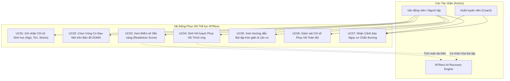
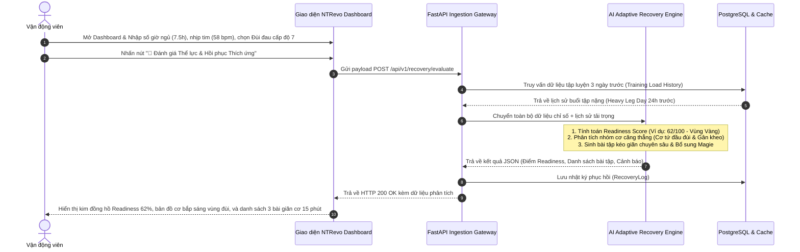
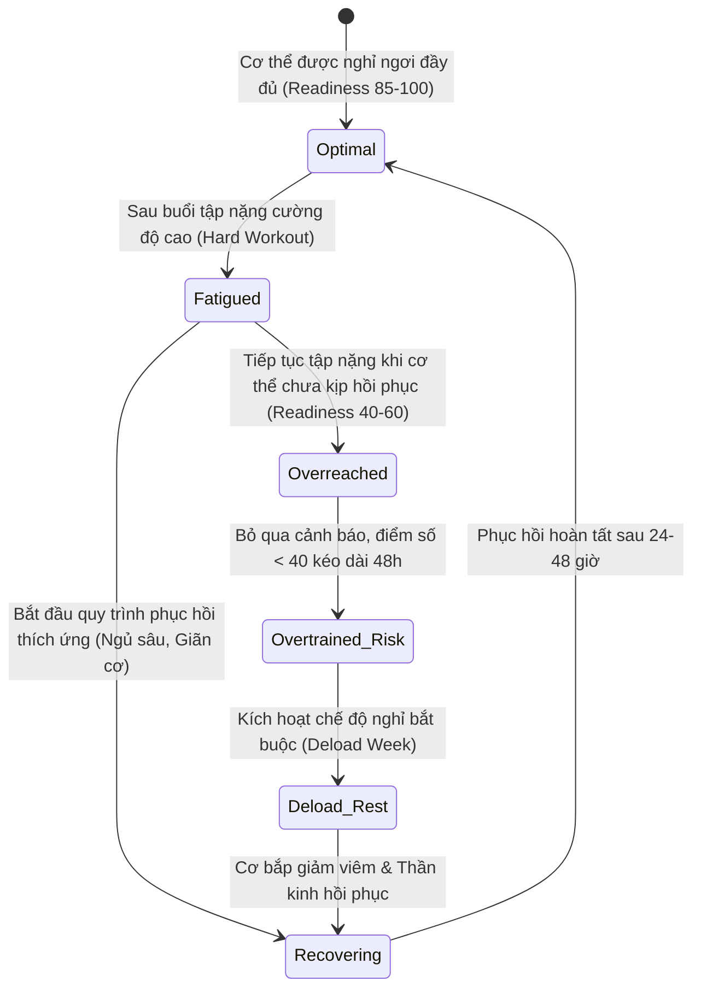
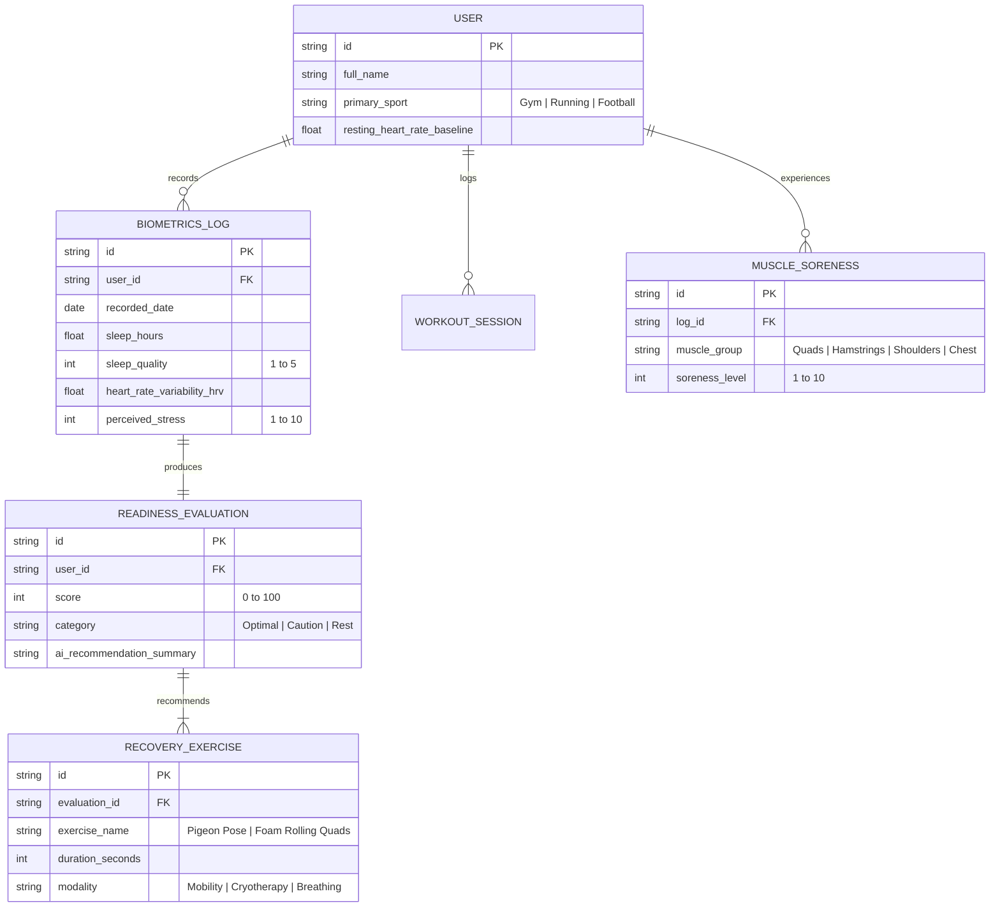

# PHÂN TÍCH YÊU CẦU & MÔ HÌNH HÓA HỆ THỐNG NTREVO
**Dự án:** NTRevo - Adaptive Fitness & Recovery Platform  
**Học phần:** Chương 3.3 Phân tích Yêu cầu & Sơ đồ Hệ thống  

---

## 1. Sơ đồ Trường hợp Sử dụng (Use Case Diagram - NTRevo)

---

## 2. Sơ đồ Tuần tự: Luồng Đánh giá Thể lực & Đề xuất Hồi phục Thích ứng (Sequence Diagram)

Mô tả chi tiết luồng xử lý từ lúc người dùng mở ứng dụng buổi sáng đến khi nhận được kế hoạch phục hồi cá nhân hóa:

---

## 3. Sơ đồ Máy Trạng thái Thể lực (State Machine: Athletic Recovery Lifecycle)

Mô tả chu trình biến đổi trạng thái thể chất của người tập:

---

## 4. Sơ đồ Mô hình Thực thể Quan hệ Dữ liệu (ERD - Data Model)

