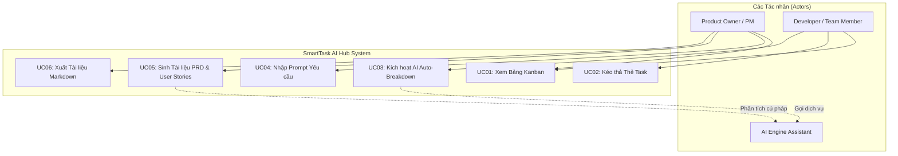
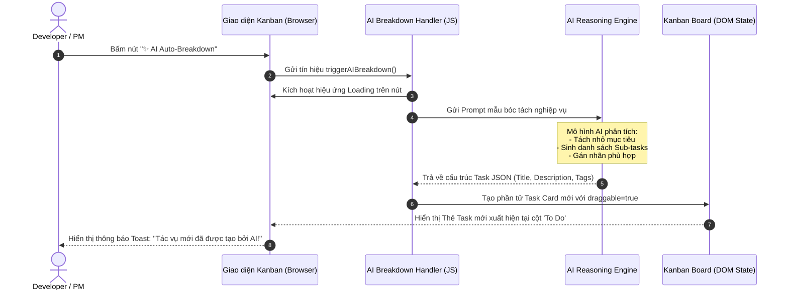
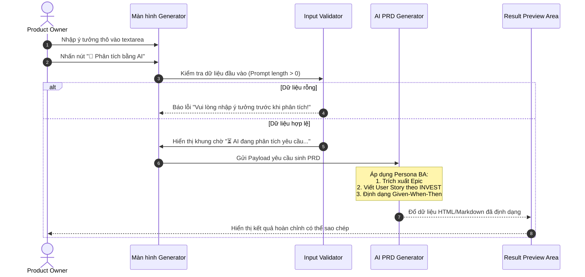
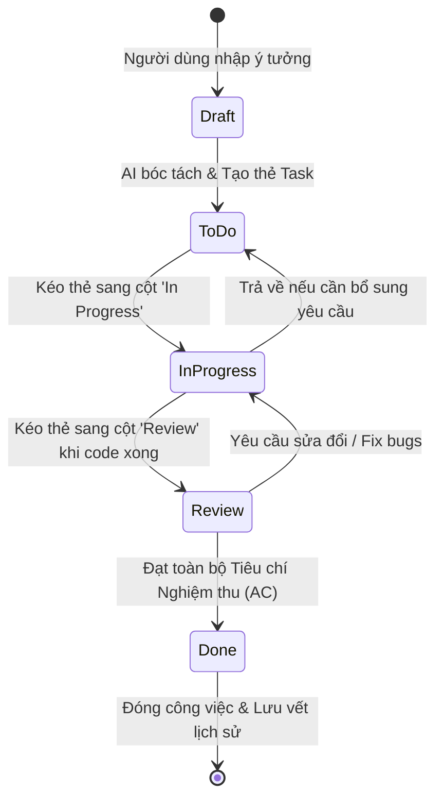
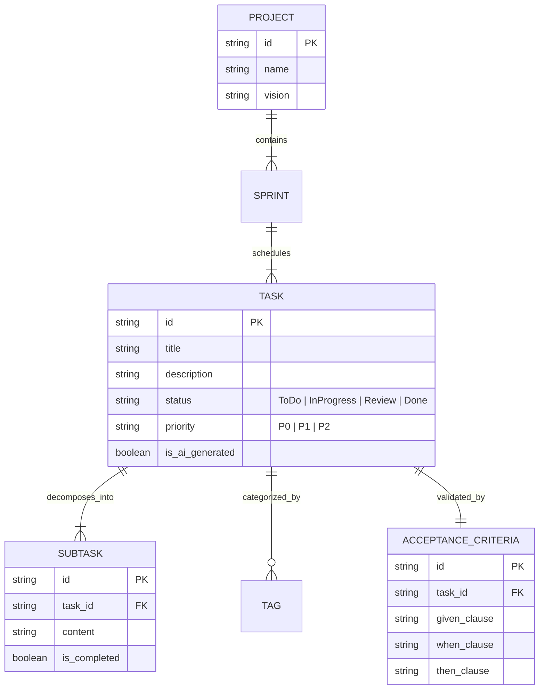

# MÔ HÌNH HÓA HỆ THỐNG VÀ SƠ ĐỒ YÊU CẦU (SYSTEM MODELING & DIAGRAMS)
**Dự án:** SmartTask AI Hub  
**Chương 3:** 3.3 Phân tích Yêu cầu & Mô hình hóa  

---

## 1. Sơ đồ Trường hợp Sử dụng (Use Case Diagram)

Dưới đây là sơ đồ mô tả tương tác giữa các tác nhân (Product Owner, Developer, AI Assistant) và hệ thống SmartTask AI Hub:

---

## 2. Sơ đồ Tuần tự: Tính năng Tự động Bóc tách Công việc (Sequence Diagram - AI Breakdown)

Mô tả luồng tương tác khi người dùng bấm nút "✨ AI Auto-Breakdown":

---

## 3. Sơ đồ Tuần tự: Tính năng Sinh PRD & User Stories (Sequence Diagram - PRD Generator)

Mô tả luồng tương tác tại màn hình `ai-generator.html`:

---

## 4. Sơ đồ Trạng thái của Công việc (State Machine Diagram - Task Lifecycle)

Vòng đời của một Task từ khi được AI sinh ra đến khi hoàn thành:

---

## 5. Sơ đồ Mô hình Dữ liệu Nghiệp vụ (Domain Entity Relationship Model)

