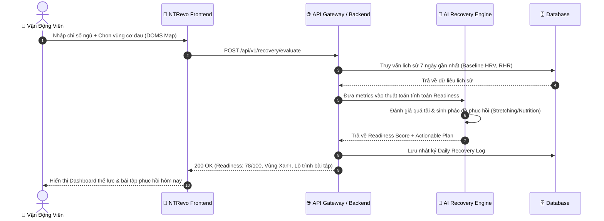
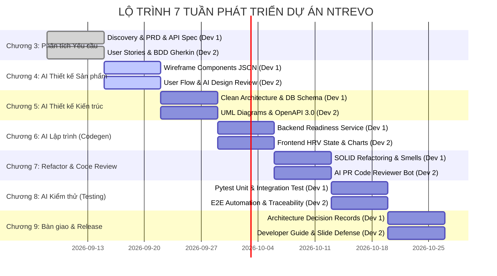

# ⚡ NTRevo - Adaptive Fitness & Recovery Platform
### Nền Tảng Trí Tuệ Nhân Tạo Phân Tích & Phục Hồi Thể Lực Thích Ứng

[](https://github.com/nguyenluongthe/NTRevo---Adaptive-fitness-recovery)
[](https://github.com/nguyenluongthe/NTRevo---Adaptive-fitness-recovery)
[-brightgreen.svg)](docs/KE_HOACH_HANG_TUAN_CHUONG_3_DEN_9.md)
[](docs/KE_HOACH_HANG_TUAN_CHUONG_3_DEN_9.md)
[](LICENSE)

---

## 📖 Mục Lục
- [1. Giới Thiệu Dự Án](#-1-giới-thiệu-dự-án)
  - [Bối cảnh & Vấn đề](#bối-cảnh--vấn-đề)
  - [Giải pháp NTRevo](#giải-pháp-ntrevo)
  - [Mục tiêu Cốt lõi (OKRs & KPIs)](#mục-tiêu-cốt-lõi-okrs--kpis)
- [2. Tính Năng Nổi Bật (Key Features)](#-2-tính-năng-nổi-bật-key-features)
- [3. Kiến Trúc Hệ Thống & Luồng Hoạt Động](#-3-kiến-trúc-hệ-thống--luồng-hoạt-động)
- [4. Danh Mục Tài Liệu Đặc Tả Chi Tiết (Docs Suite)](#-4-danh-mục-tài-liệu-đặc-tả-chi-tiết-docs-suite)
- [5. Cấu Trúc Thư Mục Repository](#-5-cấu-trúc-thư-mục-repository)
- [6. Hướng Dẫn Cài Đặt & Chạy Thử (Quick Start)](#-6-hướng-dẫn-cài-đặt--chạy-thử-quick-start)
- [7. Quy Trình Phối Hợp & Chuẩn Git (GitFlow & Authorship)](#-7-quy-trình-phối-hợp--chuẩn-git-gitflow--authorship)
- [8. Lộ Trình Triển Khai 7 Tuần (Chương 3 → Chương 9)](#-8-lộ-trình-triển-khai-7-tuần-chương-3--chương-9)
- [9. Đội Ngũ Phát Triển](#-9-đội-ngũ-phát-triển)

---

## 🎯 1. Giới Thiệu Dự Án

### Bối cảnh & Vấn đề
Trong tập luyện thể thao cường độ cao (Gym, Calisthenics, Running, Triathlon), **hội chứng quá tải (Overtraining Syndrome)** và chấn thương cơ bắp là nguyên nhân hàng đầu khiến vận động viên phải gián đoạn tập luyện. 
- Người tập thường chỉ dựa vào cảm tính hoặc tập cố định theo giáo án mà không lắng nghe tín hiệu cơ thể.
- Các thiết bị đeo (Wearables) hiện nay như Apple Watch hay Garmin cung cấp nhiều chỉ số sinh học (HRV, RHR, Sleep) nhưng **thiếu tính hành động (Actionability)**: người dùng không biết chính xác *hôm nay nên kéo giãn nhóm cơ nào, lăn bọt (foam rolling) bao lâu, hay giảm tải bao nhiêu % tạ*.

### Giải pháp NTRevo
**NTRevo (Adaptive Fitness & Recovery Platform)** là nền tảng thông minh ứng dụng AI kết hợp khoa học thể thao (Sports Science) nhằm:
1. **Thu thập kép (Dual-Input):** Kết hợp chỉ số sinh trắc học khách quan (*Giấc ngủ, Nhịp tim nghỉ ngơi RHR, HRV*) và cảm nhận thể lực chủ quan (*Bản đồ đau cơ DOMS từ 1 - 10*).
2. **Tính toán Readiness Score theo thời gian thực:** Thuật toán AI phân cấp mức độ hồi phục từ 0 đến 100 điểm với 3 vùng trạng thái: **Xanh (Sẵn sàng bứt phá)**, **Vàng (Duy trì/Thận trọng)**, và **Đỏ (Nguy cơ quá tải/Nghỉ ngơi chủ động)**.
3. **Đề xuất Lộ trình Phục hồi Thích ứng (AI Adaptive Recovery Prescription):** Tự động tạo bài tập giãn cơ (Mobility/Stretching), phác đồ trị liệu nhiệt (Sauna/Ice Bath/Contrast Shower), và dinh dưỡng bù điện giải trong vòng dưới 2.0 giây.

### Mục tiêu Cốt lõi (OKRs & KPIs)
* **Giảm thiểu chấn thương:** Giảm ít nhất **35%** nguy cơ chấn thương do quá tải ở người dùng tuân thủ khuyến nghị.
* **Độ chuẩn xác Readiness:** $\ge \mathbf{88\%}$ người dùng đồng thuận điểm số phản ánh chính xác trạng thái cơ thể.
* **Tốc độ AI:** Thời gian suy luận và đề xuất lộ trình $\le \mathbf{1.8}$ giây.
* **Tỷ lệ hoàn thành:** Trên **70%** người dùng thực hiện đủ phác đồ giãn cơ do AI đề xuất.

---

## 🚀 2. Tính Năng Nổi Bật (Key Features)

| Tính năng | Mã FR | Mô tả chi tiết |
| :--- | :--- | :--- |
| **Ghi nhận Dữ liệu Thể lực Buổi sáng** | `FR-01` | Nhập nhanh giờ ngủ, chất lượng giấc ngủ (1-5 sao), nhịp tim nghỉ ngơi RHR, mức độ stress. |
| **Bản đồ Cơ bắp Đau nhức (DOMS Map)** | `FR-02` | Giao diện cơ thể trực quan cho phép click chọn nhóm cơ đau (Ngực, Lưng, Đùi, Vai, Bắp chân) và gán độ đau 1-10. |
| **AI Readiness Score Engine** | `FR-03` | Tính toán điểm phục hồi tức thì dựa trên trọng số HRV ($35\%$), Giấc ngủ ($30\%$), DOMS ($20\%$), RHR ($15\%$). |
| **Lộ trình Phục hồi Thích ứng** | `FR-04` | AI tự động sinh giáo án giãn cơ Mobility, bài tập Foam Rolling theo từng cơ mục tiêu, chế độ dinh dưỡng phục hồi. |
| **Hệ thống Cảnh báo Quá tải Sớm** | `FR-05` | Tự động phát tín hiệu cảnh báo đỏ khi Readiness $< 40$ trong 2 ngày liên tiếp, khuyến nghị cắt giảm 50% cường độ tập. |
| **Trực quan hóa Xu hướng Phục hồi** | `FR-06` | Biểu đồ biến thiên trực quan so sánh nhịp tim, chất lượng ngủ và hiệu suất thể lực theo tuần/tháng. |
| **Xuất Báo cáo HLV & Báo cáo Tuần** | `FR-07` | Hỗ trợ xuất dữ liệu ra Markdown/PDF để Vận động viên trao đổi với Huấn luyện viên cá nhân (PT/Coach). |

---

## 🏗️ 3. Kiến Trúc Hệ Thống & Luồng Hoạt Động

### Sơ đồ Luồng Đánh Giá Buổi Sáng (Morning Readiness Flow)



---

## 📚 4. Danh Mục Tài Liệu Đặc Tả Chi Tiết (Docs Suite)

Hệ thống tài liệu dự án được xây dựng toàn diện theo tiêu chuẩn môn học **Ứng dụng Trí tuệ Nhân tạo trong Kỹ nghệ Phần mềm** tại thư mục [`docs/PRD/`](docs/PRD/):

| STT | Tài liệu chi tiết | Trọng tâm nghiệp vụ |
| :---: | :--- | :--- |
| 📄 **01** | [**01_Product_Discovery_NTRevo.md**](docs/PRD/01_Product_Discovery_NTRevo.md) | Phân tích vấn đề quá tải, khảo sát đối thủ (Whoop, Oura, Garmin), 3 User Personas, Value Proposition Canvas, SWOT, Customer Journey Map. |
| 📋 **02** | [**02_PRD_NTRevo_Platform.md**](docs/PRD/02_PRD_NTRevo_Platform.md) | Tài liệu Yêu cầu Sản phẩm tổng thể: OKRs, Scope In/Out, 7 Yêu cầu Chức năng (FR), 3 Yêu cầu Phi chức năng (NFR về SLA $\le 1.8$s, chuẩn bảo mật HIPAA/GDPR). |
| 📐 **03** | [**03_Requirements_Analysis_and_Architecture_NTRevo.md**](docs/PRD/03_Requirements_Analysis_and_Architecture_NTRevo.md) | Sơ đồ Use Case Mermaid, Sequence Diagram, State Machine vòng đời thể lực, Sơ đồ CSDL Quan hệ ERD chuẩn 3NF. |
| 🧪 **04** | [**04_User_Stories_and_Gherkin_BDD_NTRevo.md**](docs/PRD/04_User_Stories_and_Gherkin_BDD_NTRevo.md) | Bộ User Stories chuẩn INVEST, phân bổ Story Points, kịch bản kiểm thử BDD/Gherkin (Happy Path, Edge Cases, Xử lý lỗi cảm biến). |
| 🔌 **05** | [**05_API_Specifications_NTRevo.md**](docs/PRD/05_API_Specifications_NTRevo.md) | Hợp đồng API RESTful (`POST /evaluate`, `POST /biometrics`, `GET /trends`), JSON Schemas, Mã lỗi HTTP (400, 422, 503) & Fallback Heuristics. |
| 🗓️ **06** | [**KE_HOACH_HANG_TUAN_CHUONG_3_DEN_9.md**](docs/KE_HOACH_HANG_TUAN_CHUONG_3_DEN_9.md) | Kế hoạch chi tiết phân công 2 thành viên từ Chương 3 đến Chương 9, quy ước nhánh GitFlow và kiểm soát tỷ lệ đóng góp 50/50. |

---

## 📁 5. Cấu Trúc Thư Mục Repository

```plaintext
NTRevo---Adaptive-fitness-recovery/
├── .git/                                   # Git Version Control
├── README.md                               # Tài liệu tổng quan dự án (File hiện tại)
├── docs/                                   # Thư mục tài liệu kỹ thuật & nghiệp vụ
│   ├── KE_HOACH_HANG_TUAN_CHUONG_3_DEN_9.md # Lộ trình 7 tuần & Phân công vai trò
│   ├── 01_Product_Discovery.md             # Tài liệu Discovery khái quát
│   ├── 02_PRD_SmartTask_AI.md              # Tài liệu tham khảo Sprint tiền đề
│   ├── 03_Requirements_Analysis.md         # Phân tích yêu cầu tham chiếu
│   ├── 04_User_Stories_Acceptance_Criteria.md
│   ├── 05_Feature_API_Specifications.md
│   └── PRD/                                # BỘ ĐẶC TẢ SẢN PHẨM CHÍNH THỨC CỦA DỰ ÁN NTREVO
│       ├── README.md                       # Giới thiệu thư mục PRD
│       ├── 01_Product_Discovery_NTRevo.md  # 3.1 Khám phá sản phẩm NTRevo
│       ├── 02_PRD_NTRevo_Platform.md       # 3.2 PRD toàn diện NTRevo Platform
│       ├── 03_Requirements_Analysis_and_Architecture_NTRevo.md # 3.3 Sơ đồ Kiến trúc & ERD
│       ├── 04_User_Stories_and_Gherkin_BDD_NTRevo.md           # 3.4 BDD Gherkin Test Cases
│       └── 05_API_Specifications_NTRevo.md # 3.5 Đặc tả RESTful API Contracts
└── frontend/                               # Ứng dụng giao diện nguyên mẫu (Prototype Web)
    ├── index.html                          # Dashboard theo dõi thể lực & Kanban điều phối
    ├── ai-generator.html                   # Giao diện tương tác AI Recovery Generator
    ├── css/
    │   └── styles.css                      # Hệ thống giao diện Modern Dark/Glassmorphism UI
    └── js/
        ├── app.js                          # Xử lý tương tác kéo thả & trạng thái Dashboard
        └── ai-generator.js                 # Xử lý form AI Prompt & sinh phác đồ phục hồi
```

---

## 💻 6. Hướng Dẫn Cài Đặt & Chạy Thử (Quick Start)

### Yêu cầu tiên quyết
- Trình duyệt hiện đại hỗ trợ ES6 (Google Chrome, Microsoft Edge, Brave, Safari).
- Visual Studio Code cùng extension **Live Server** (hoặc Python 3 để chạy HTTP server cục bộ).

### Các bước khởi chạy nhanh
1. **Clone repository về máy tính:**
   ```bash
   git clone https://github.com/nguyenluongthe/NTRevo---Adaptive-fitness-recovery.git
   cd NTRevo---Adaptive-fitness-recovery
   ```

2. **Chạy giao diện trực quan (Frontend Prototype):**
   - *Cách 1:* Mở thư mục bằng VS Code, nhấp chuột phải vào file `frontend/index.html` và chọn **Open with Live Server**.
   - *Cách 2:* Khởi tạo server cục bộ nhanh bằng Python:
     ```bash
     python -m http.server 8000
     ```
     Sau đó truy cập: [http://localhost:8000/frontend/index.html](http://localhost:8000/frontend/index.html)

3. **Trải nghiệm tính năng:**
   - Xem bảng điều khiển và tác vụ tại trang **Dashboard** (`index.html`).
   - Chuyển sang màn hình **AI Generator** (`ai-generator.html`) để thử nghiệm form sinh kịch bản và phác đồ thích ứng.

---

## 🌿 7. Quy Trình Phối Hợp & Chuẩn Git (GitFlow & Authorship)

Nhằm đáp ứng tiêu chí đánh giá tự động và chấm điểm chuẩn mực theo yêu cầu môn học:

### 1. Phân chia nhánh (GitFlow Standard)
* `main`: Nhánh ổn định, chứa các bản phát hành cuối mỗi tuần/chương.
* `develop`: Nhánh tích hợp mã nguồn chung.
* Nhánh tính năng cá nhân:
  * **Dev 1:** `feat/w<tuan>-dev1-<ten-tinh-nang>`
  * **Dev 2:** `feat/w<tuan>-dev2-<ten-tinh-nang>`

### 2. Quy tắc Commit & Review chéo (Peer Review 50% - 50%)
* **Quy chuẩn Conventional Commits:**
  * `feat:` Tính năng mới (UI, Logic, API)
  * `docs:` Bổ sung hoặc chỉnh sửa tài liệu đặc tả
  * `test:` Kịch bản kiểm thử, BDD Gherkin, Pytest
  * `refactor:` Tối ưu mã nguồn, chuẩn hóa kiến trúc
* **Quy trình Pull Request:**
  - Thành viên tạo PR từ nhánh `feat/...` vào `develop`.
  - Thành viên còn lại bắt buộc tham gia Review, để lại ít nhất 1-2 bình luận chuyên môn trước khi bấm **Approve & Merge**.
  - Đảm bảo số lượng commit và khối lượng đóng góp cân bằng giữa 2 thành viên.

---

## 📅 8. Lộ Trình Triển Khai 7 Tuần (Chương 3 → Chương 9)



---

## 👥 9. Đội Ngũ Phát Triển

| Vai trò | Phân công phụ trách | Trách nhiệm chính |
| :--- | :--- | :--- |
| **Dev 1: Backend & AI Core Lead** | `@nguyenluongthe` (hoặc Dev 1) | Kiến trúc hệ thống, Thuật toán AI Recovery Engine, Thiết kế RESTful API, CSDL Quan hệ & NFR Performance. |
| **Dev 2: Frontend & QA/BA Specialist** | Đồng sự nhóm (Dev 2) | Thiết kế UI/UX Dashboard, Trực quan hóa dữ liệu sinh học, Đặc tả User Stories BDD Gherkin, E2E Automation Testing. |

---

<p align="center">
  <b>NTRevo Platform</b> • Trí Tuệ Nhân Tạo Phục Vụ Thể Thao Đỉnh Cao & Phục Hồi Thể Lực Bền Vững<br>
  <i>Đồ án môn học: Ứng dụng Trí tuệ Nhân tạo trong Kỹ nghệ Phần mềm</i>
</p>