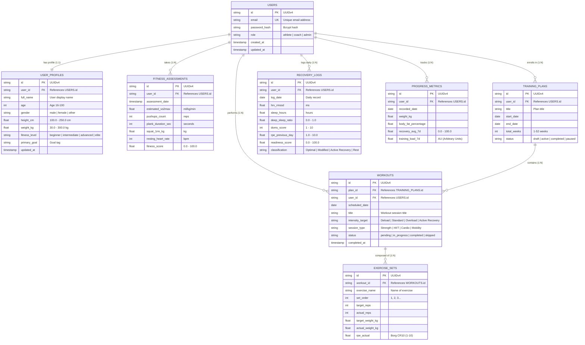

# 🗄️ SƠ ĐỒ QUAN HỆ THỰC THỂ CƠ SỞ DỮ LIỆU (MERMAID ERD)
## NTRevo 3NF Normalized Relational Architecture
**Tác giả:** Dev 1 - Backend Lead (`Dev1-BackendLead`)  
**Sprint:** 3 (Chương 5: AI trong Thiết kế & Kiến trúc Phần mềm)  
**Tiêu chuẩn đáp ứng:** 3NF, Foreign Key Integrity, OpenAPI Data Mapping  

---

## 1. SƠ ĐỒ THỰC THỂ LIÊN KẾT (MERMAID ER DIAGRAM)

---

## 2. NGUYÊN TẮC CHUẨN HÓA 3NF ĐÃ ÁP DỤNG

1. **Chuẩn 1 (1NF):** Tất cả các thuộc tính đều mang giá trị nguyên tố (Atomic values). Không có danh sách mảng lồng nhau (Nested Arrays) trong các bảng giao dịch; các bài tập và set tập được chuẩn hóa ra bảng riêng `exercise_sets`.
2. **Chuẩn 2 (2NF):** Toàn bộ các thuộc tính phi khóa đều phụ thuộc hàm đầy đủ vào toàn bộ khóa chính (Không có phụ thuộc bộ phận).
3. **Chuẩn 3 (3NF):** Loại bỏ hoàn toàn phụ thuộc bắc cầu (Transitive Dependencies). Dữ liệu hồ sơ người dùng không lưu lẫn vào bảng đăng nhập mà tách sang `user_profiles`. Kế hoạch tập không lưu trực tiếp set tập mà đi qua `workouts`.
