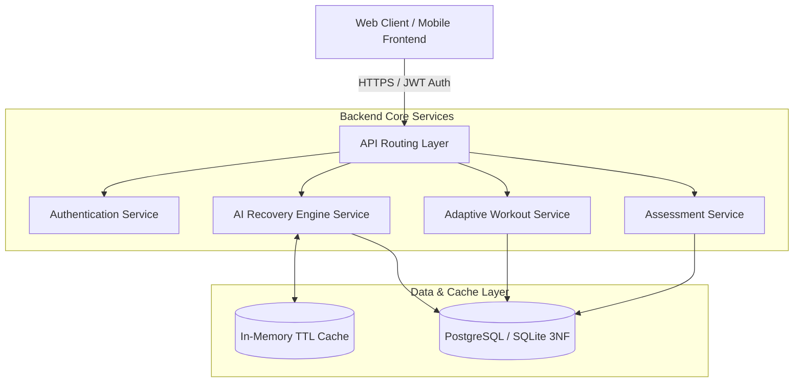

# 📐 TÀI LIỆU ĐẶC TẢ KỸ THUẬT SẢN PHẨM (TECHNICAL PRD)
## NTRevo - Adaptive Fitness & Recovery Platform
**Phiên bản:** 1.0.0-PROD  
**Tác giả:** Dev 1 - Backend Lead & AI Core Architecture (`Dev1-BackendLead`)  
**Trạng thái:** Approved  
**Ngày cập nhật:** 08/09/2026  

---

## 1. TỔNG QUAN HỆ THỐNG & MỤC TIÊU KỸ THUẬT

### 1.1 Sứ mệnh kỹ thuật
NTRevo là nền tảng thể hình thích nghi theo thời gian thực (Real-time Adaptive Fitness Engine), tích hợp khả năng tính toán chỉ số hồi phục thể chất (Readiness Score) dựa trên tín hiệu sinh trắc học (Biometrics) thu thập từ thiết bị đeo (Wearables/Smartwatches) và nhật ký người dùng.

### 1.2 Chỉ số Hiệu năng Phi chức năng cốt lõi (NFRs)
- **NFR-P01 (Tốc độ phản hồi API):** Thời gian phản hồi 95% API calls dưới **200ms** trong điều kiện tải bình thường.
- **NFR-P02 (Tốc độ sinh kế hoạch AI):** Thuật toán Adaptive Engine tổng hợp dữ liệu và sinh buổi tập thích nghi trong dưới **2.0 giây**.
- **NFR-S01 (Bảo mật dữ liệu sinh trắc học):** Mã hóa toàn bộ dữ liệu nhạy cảm chuẩn AES-256 ở trạng thái nghỉ (at rest) và TLS 1.3 trong truyền tải (in transit).
- **NFR-M01 (Khả năng kiểm thử):** Tỷ lệ bao phủ kiểm thử tự động (Unit & Integration Coverage) đạt $\ge 85\%$.

---

## 2. PHÂN HỆ VÀ RANH GIỚI HỆ THỐNG (SYSTEM BOUNDARIES)

### 2.1 Chi tiết các phân hệ
1. **Phân hệ Quản lý Danh tính & Hồ sơ (Auth & User Profile):**
   - Đảm nhiệm việc đăng ký, đăng nhập JWT, giải mã phân quyền RBAC (`user`, `coach`, `admin`).
   - Lưu trữ các thông số cơ bản: Tuổi, Giới tính, Chiều cao, Cân nặng, Mục tiêu thể hình, Tình trạng chấn thương.
2. **Phân hệ Đánh giá Thể lực Ban đầu (Fitness Assessment):**
   - Đánh giá sức mạnh (1RM ước tính), sức bền tim mạch (VO2max ước tính), độ linh hoạt khớp.
   - Tính toán chỉ số **FitnessScore™ (1-100)** làm mốc tham chiếu cho toàn bộ chu kỳ tập luyện.
3. **Phân hệ AI Recovery Engine (Động cơ Thích nghi & Phục hồi):**
   - Nhận dữ liệu HRV (rMSSD), Thời lượng & Chất lượng Giấc ngủ, Chỉ số đau mỏi cơ (DOMS), Mức gắng sức buổi tập trước (RPE).
   - Xuất ra điểm phục hồi hàng ngày **Readiness Score (0-100)** và khuyến nghị khối lượng tập (Volume/Intensity multiplier).
4. **Phân hệ Điều phối Buổi tập Thích ứng (Adaptive Workout Coordinator):**
   - Lựa chọn bài tập thay thế tương đương sinh cơ học khi phát hiện chỉ số đau mỏi vùng cơ cụ thể.
   - Điều chỉnh số set, rep, tạ theo cơ chế tự điều hòa RPE/RIR (Reps in Reserve).

---

## 3. TIÊU CHUẨN THIẾT KẾ CƠ SỞ DỮ LIỆU & DỮ LIỆU ĐẦU VÀO

- Lược đồ cơ sở dữ liệu quan hệ tuân thủ nghiêm ngặt **Chuẩn hóa 3NF (Third Normal Form)**, tránh dư thừa dữ liệu (Data Redundancy).
- Sử dụng UUIDv4 cho khóa chính các bảng giao dịch để đảm bảo tính phân tán và bảo mật.
- Chuẩn hóa thời gian lưu trữ theo chuẩn ISO-8601 UTC.
- Toàn bộ các trường số đo sinh trắc học có ràng buộc miền giá trị hợp lệ (`CHECK constraints`).

---

## 4. CHIẾN LƯỢC TỐI ƯU CACHING & HIỆU NĂNG

Để đảm bảo đáp ứng tiêu chuẩn **NFR-P02 (< 2.0s)**:
- Dữ liệu tính toán Readiness Score và Lịch tập ngày hôm nay được lưu vào Cache với TTL 3.600 giây (1 giờ).
- Cache Invalidation Event: Bất cứ khi nào người dùng gửi nhật ký phục hồi mới (`POST /api/v1/recovery/log`) hoặc hoàn thành một set tập mới (`POST /api/v1/workouts/active/sets`), Cache tương ứng của User sẽ tự động bị xóa (Invalidate) để tính toán lại tức thì.
