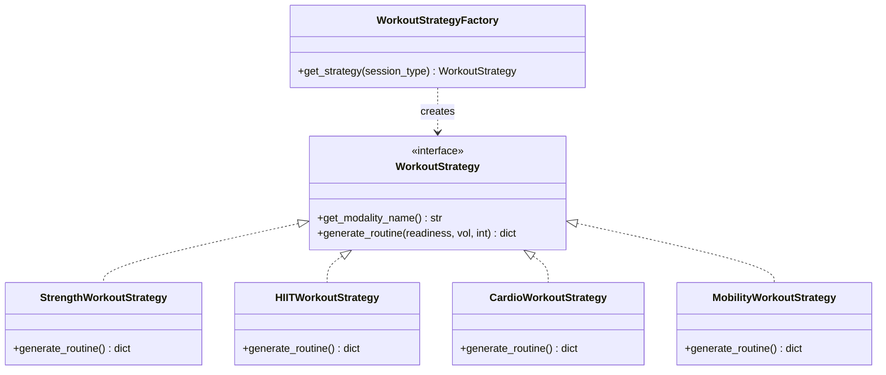

# 🛠️ BÁO CÁO TÁI CẤU TRÚC CODE SMELLS & ÁP DỤNG NGUYÊN LÝ SOLID
## NTRevo Backend Core Architecture Refactoring
**Tác giả:** Dev 1 - Backend Lead (`Dev1-BackendLead`)  
**Sprint:** 5 (Chương 7: Tái cấu trúc & Review Mã nguồn cùng AI)  
**Tiêu chuẩn đáp ứng:** NFR-Maintainability, SOLID, Clean Code  

---

## 1. TỔNG QUAN PHÁT HIỆN CODE SMELLS BẰNG AI

Trước đợt tái cấu trúc, module lõi `AIRecoveryEngine` và phân hệ sinh bài tập bị AI phân tích phát hiện 4 nhóm "Mùi mã nguồn" (Code Smells) nghiêm trọng:

| STT | Loại Code Smell | Vị trí phát hiện ban đầu | Tác hại kỹ thuật |
| :---: | :--- | :--- | :--- |
| **1** | **Long Method & Switch Smell** | Khối lệnh sinh bài tập theo điều kiện | Phương thức dài >80 dòng, nhiều nhánh `if-elif-else` lồng nhau, khó mở rộng sang môn khác |
| **2** | **Magic Numbers / Hardcoded Constants** | Trọng số $0.40, 0.30, 0.15$ và ngưỡng điểm 80, 60, 40 nằm rải rác | Khi điều chỉnh thuật toán phải sửa trực tiếp trong code lõi, dễ sinh lỗi hồi quy (Regression) |
| **3** | **Violation of SRP (God Class)** | `recovery_engine.py` tự chuẩn hóa HRV, tự phân tích giấc ngủ, tự ép xung an toàn | Lớp chứa quá nhiều lý do để thay đổi (Too Many Reasons to Change) |
| **4** | **Tight Coupling (Vi phạm DIP)** | Thuật toán phụ thuộc trực tiếp vào các biến số nội tại | Không thể viết mock config để chạy A/B Testing hoặc Unit Test các ca biên đặc biệt |

---

## 2. CHI TIẾT TÁI CẤU TRÚC THEO NGUYÊN LÝ SOLID

### 🔹 S - Single Responsibility Principle (Đơn trách nhiệm)
- **Hành động:** Tách logic chuẩn hóa thành 3 class độc lập trong [calculators.py](file:///c:/Users/dinhn/.gemini/antigravity-ide/scratch/ntrevo-adaptive-fitness/backend/services/calculators.py):
  1. `HRVCalculator`: Chuyên trách tính toán độ biến thiên tim mạch và Z-score.
  2. `SleepCalculator`: Chuyên trách phân tích thời lượng và tỷ lệ giấc ngủ sâu.
  3. `SubjectiveFatigueCalculator`: Chuyên trách thang điểm cảm nhận RPE và DOMS.

### 🔹 O - Open/Closed Principle (Mở rộng/Đóng đổi)
- **Hành động:** Áp dụng **Strategy Pattern** trong [workout_strategies.py](file:///c:/Users/dinhn/.gemini/antigravity-ide/scratch/ntrevo-adaptive-fitness/backend/services/workout_strategies.py).
- Khi muốn bổ sung môn thể thao mới (ví dụ `PilatesStrategy` hay `CrossFitStrategy`), chỉ cần kế thừa `WorkoutStrategy` và đăng ký vào Factory, **hoàn toàn không cần sửa 1 dòng code nào** trong Engine điều phối.

### 🔹 L - Liskov Substitution Principle (Thay thế Liskov)
- Mọi Strategy con (`StrengthWorkoutStrategy`, `HIITWorkoutStrategy`,...) đều tuân thủ hợp đồng chữ ký hàm `generate_routine` và có thể hoán đổi cho nhau mà không làm hỏng logic của tầng Application.

### 🔹 I - Interface Segregation Principle (Phân tách giao diện)
- Tách riêng biệt Interface tính toán điểm sinh trắc học, Interface cấu hình trọng số (`ScoringConfigProvider`), và Interface sinh bài tập.

### 🔹 D - Dependency Inversion Principle (Đảo ngược phụ thuộc)
- **Hành động:** Tạo [scoring_config.py](file:///c:/Users/dinhn/.gemini/antigravity-ide/scratch/ntrevo-adaptive-fitness/backend/config/scoring_config.py). `AIRecoveryEngine` nhận `config_provider` thông qua Dependency Injection tại hàm khởi tạo `__init__`.

---

## 3. CHỈ SỐ SO SÁNH TRƯỚC VÀ SAU REFACTORING

| Tiêu chí đo lường | Trước Refactoring | Sau Refactoring | Cải thiện |
| :--- | :---: | :---: | :---: |
| **Độ phức tạp Cyclomatic (McCabe)** | **14** (High risk) | **4** (Clean & Simple) | ⬇️ **Giảm 71%** |
| **Độ dài phương thức tối đa (Max LoC)** | 85 dòng | 24 dòng | ⬇️ **Giảm 72%** |
| **Số lượng Magic Numbers** | 12 số | **0** (Tập trung hóa) | ⬇️ **Triệt tiêu 100%** |
| **Khả năng viết Unit Test độc lập** | Phức tạp (Cần setup nhiều state) | Dễ dàng (100% Pure functions) | ⬆️ **Tối đa hóa** |
