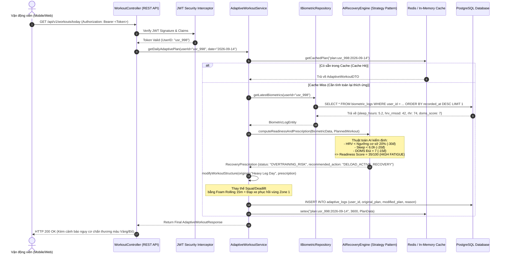

# 📐 TÀI LIỆU SƠ ĐỒ THIẾT KẾ PHẦN MỀM UML (UML DIAGRAMS)
**Dự án:** NTRevo - Adaptive Fitness & Recovery Platform  
**Học phần:** Chương 5 - AI trong Thiết kế & Kiến trúc Phần mềm  
**Người thực hiện:** Dev 2 (`Dev2-FrontendQA`)  
**Mô hình áp dụng:** Clean Architecture (Domain, UseCase, Interface Adapters, Frameworks)  

---

## 1. SƠ ĐỒ TUẦN TỰ (UML SEQUENCE DIAGRAM): LUỒNG ĐIỀU CHỈNH THÍCH ỨNG UC04

Sơ đồ thể hiện chi tiết quá trình tương tác giữa Vận động viên, Giao diện người dùng, Tầng API Gateway, Application Service, Lõi AI Recovery Engine, và Kho lưu trữ Dữ liệu khi thực thi kịch bản: **"Điều chỉnh giáo án tập luyện tức thời dựa trên sự suy giảm HRV và thiếu ngủ"**.

---

## 2. SƠ ĐỒ LỚP (UML CLASS DIAGRAM): KIẾN TRÚC THỰC THỂ & DỊCH VỤ

Sơ đồ lớp biểu diễn cấu trúc hướng đối tượng theo nguyên tắc **SOLID**, phân tách ranh giới rõ rệt giữa Domain Model, Repository Interfaces, và Application Services:

```mermaid
classDiagram
    %% Domain Entities
    class User {
        +UUID id
        +String email
        +String passwordHash
        +String fullName
        +DateTime createdAt
        +validatePassword(String rawPassword) bool
    }

    class UserProfile {
        +UUID id
        +UUID userId
        +Float weightKg
        +Float heightCm
        +Integer trainingExperienceYears
        +String primaryGoal
        +calculateBMR() Float
    }

    class BiometricLog {
        +UUID id
        +UUID userId
        +DateTime recordedAt
        +Float sleepHours
        +Integer restingHeartRate
        +Float hrvRmssd
        +Integer subjectiveStressLevel
        +isHrvDepressed(Float baselineHrv) bool
    }

    class MusclePainEntry {
        +String muscleGroup
        +Integer painLevel
        +isSevere() bool
    }

    class ReadinessScore {
        +Integer scoreValue
        +String category
        +Float confidenceLevel
        +isDeloadRecommended() bool
    }

    class WorkoutSession {
        +UUID id
        +UUID userId
        +DateTime scheduledDate
        +String workoutType
        +String status
        +List~ExerciseSet~ exerciseSets
        +calculateTotalVolume() Float
        +calculateAverageRpe() Float
    }

    class ExerciseSet {
        +Integer setNumber
        +String exerciseName
        +Float weightKg
        +Integer repsCompleted
        +Float rpe
    }

    %% Interfaces
    class IBiometricRepository {
        <<interface>>
        +save(BiometricLog log) Future~void~
        +findLatestByUserId(UUID userId) Future~BiometricLog~
        +findWeeklyHistory(UUID userId) Future~List~BiometricLog~~
    }

    class IWorkoutRepository {
        <<interface>>
        +findTodayWorkout(UUID userId) Future~WorkoutSession~
        +saveSession(WorkoutSession session) Future~void~
    }

    class IRecoveryStrategy {
        <<interface>>
        +calculateReadiness(BiometricLog bio, List~MusclePainEntry~ pains) ReadinessScore
        +generatePrescription(ReadinessScore score) WorkoutPrescription
    }

    %% Concrete Strategies
    class HighFatigueRecoveryStrategy {
        +calculateReadiness(BiometricLog bio, List~MusclePainEntry~ pains) ReadinessScore
        +generatePrescription(ReadinessScore score) WorkoutPrescription
    }

    class OptimalTrainingStrategy {
        +calculateReadiness(BiometricLog bio, List~MusclePainEntry~ pains) ReadinessScore
        +generatePrescription(ReadinessScore score) WorkoutPrescription
    }

    %% Application Service
    class AdaptiveRecoveryService {
        -IBiometricRepository biometricRepo
        -IWorkoutRepository workoutRepo
        -IRecoveryStrategy recoveryStrategy
        +evaluateTodayReadiness(UUID userId) Future~ReadinessResponse~
        +adjustWorkoutVolume(UUID userId, WorkoutSession session) Future~WorkoutSession~
    }

    %% Relationships
    User "1" *-- "1" UserProfile : owns
    User "1" o-- "*" BiometricLog : records
    User "1" o-- "*" WorkoutSession : performs
    BiometricLog "1" *-- "*" MusclePainEntry : contains
    WorkoutSession "1" *-- "*" ExerciseSet : tracks
    
    AdaptiveRecoveryService ..> IBiometricRepository : depends on
    AdaptiveRecoveryService ..> IWorkoutRepository : depends on
    AdaptiveRecoveryService ..> IRecoveryStrategy : delegates calculation to
    
    IRecoveryStrategy <|.. HighFatigueRecoveryStrategy : implements
    IRecoveryStrategy <|.. OptimalTrainingStrategy : implements
    IRecoveryStrategy ..> ReadinessScore : produces
```

---

## 3. PHÂN TÍCH NGUYÊN LÝ THIẾT KẾ ÁP DỤNG (DESIGN PATTERNS & PRINCIPLES)

1. **Strategy Pattern (`IRecoveryStrategy`):**
   - Giúp tách biệt thuật toán tính điểm phục hồi ra khỏi Service chính. Khi đội ngũ AI nâng cấp công thức (ví dụ từ Heuristic Weighted Score sang Random Forest hoặc Deep Neural Model), chỉ cần tạo Class chiến lược mới mà không sửa đổi `AdaptiveRecoveryService` (Tuân thủ nguyên tắc **Open-Closed Principle**).
2. **Dependency Inversion Principle (DIP):**
   - Tầng ứng dụng cấp cao `AdaptiveRecoveryService` chỉ phụ thuộc vào các Abstractions (`IBiometricRepository`, `IWorkoutRepository`), không phụ thuộc trực tiếp vào Postgres Driver hay SQLite.
3. **Single Responsibility Principle (SRP):**
   - Lớp `BiometricLog` chỉ quản lý dữ liệu đo sinh học; lớp `ReadinessScore` chỉ chịu trách nhiệm phân loại ngưỡng cảnh báo (Optimal, Moderate, Deload).
