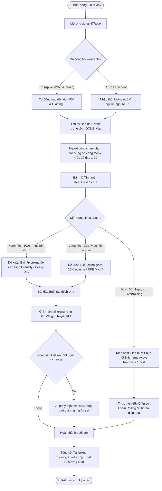
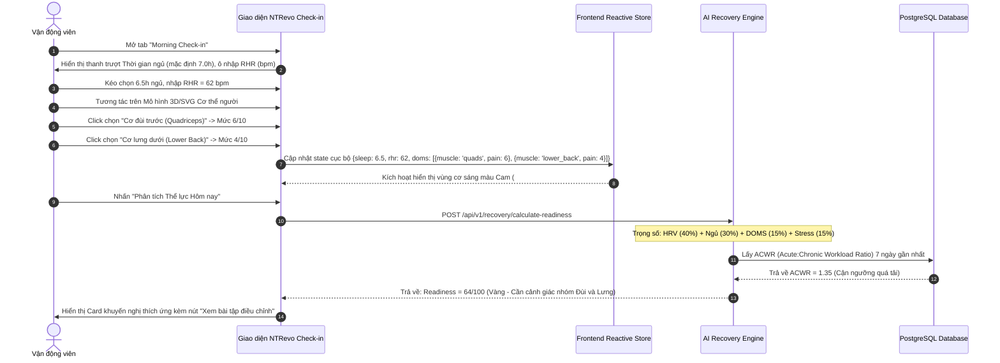
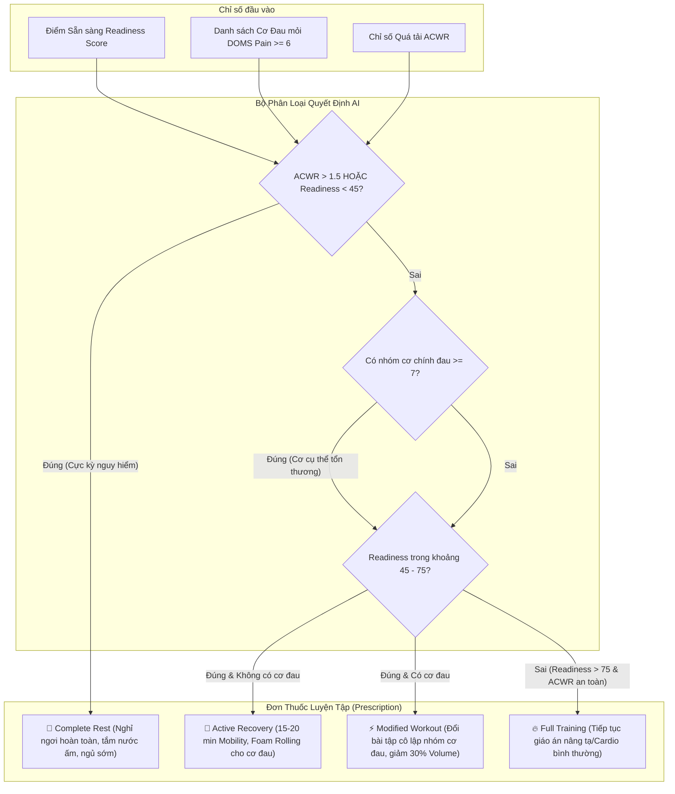

# 🧭 TÀI LIỆU SƠ ĐỒ LUỒNG NGƯỜI DÙNG TOÀN DIỆN (MERMAID USER FLOWS)
**Dự án:** NTRevo - Adaptive Fitness & Recovery Platform  
**Học phần:** Chương 4 - AI trong Thiết kế Sản phẩm & UI/UX  
**Người thực hiện:** Dev 2 (`Dev2-FrontendQA`)  
**Tiêu chuẩn:** Agile UX, Thiết kế lấy người dùng làm trung tâm (UCD), Tuân thủ chuẩn tiếp cận WCAG 2.1 AA  

---

## 1. TỔNG QUAN HÀNH TRÌNH NGƯỜI DÙNG (END-TO-END ATHLETE JOURNEY)

Sơ đồ thể hiện toàn bộ vòng đời tương tác hàng ngày của vận động viên / người tập thể hình với nền tảng NTRevo: từ thức dậy đo chỉ số sinh học, tiếp nhận điểm sẵn sàng (Readiness Score), thực hiện bài tập thích ứng hoặc phục hồi chủ động, đến theo dõi tiến độ dài hạn.



---

## 2. LUỒNG CHI TIẾT: ĐO CHỈ SỐ SINH HỌC & BẢN ĐỒ CƠ BẮP (MORNING BIOMETRICS & DOMS)



---

## 3. LUỒNG QUYẾT ĐỊNH THÍCH ỨNG BÀI TẬP (ADAPTIVE WORKOUT DECISION MATRIX)

Luồng kiểm tra điều kiện logic mà AI Recovery Engine thực thi để quyết định bài tập thay thế nhằm ngăn ngừa chấn thương:



---

## 4. LUỒNG PHÒNG NGỪA CHẤN THƯƠNG & CẢNH BÁO QUÁ TẢI (OVERTRAINING PROTOCOL)

```mermaid
flowchart LR
    subgraph Monitor ["Giám sát Liên tục"]
        M1[HRV giảm > 20% liên tiếp 3 ngày]
        M2[Khối lượng tập tăng đột ngột > 30%/tuần]
        M3[Điểm RPE trung bình mỗi buổi > 8.5]
    end

    subgraph AlertSystem ["Hệ thống Cảnh báo Thông minh"]
        A1{Phát hiện bất thường?}
        A2[Popup Cảnh báo Đỏ: Nguy cơ Chấn thương Cơ / Gân]
        A3[Thông báo tới Huấn luyện viên Coach Dashboard]
        A4[Khóa bài tập tạ nặng Compound (Squat/Deadlift) trong 48h]
    end

    subgraph Resolution ["Giải pháp Can thiệp"]
        R1[Đề xuất giáo án Deload Week tự động]
        R2[Bài tập bổ trợ vật lý trị liệu khớp gối/cột sống]
    end

    M1 & M2 & M3 --> A1
    A1 -- Phát hiện rủi ro cao --> A2 & A3 & A4
    A2 --> R1
    A4 --> R2
```

---

## 5. TỔNG KẾT TIÊU CHUẨN UX & TRẢI NGHIỆM TƯƠNG TÁC
- **Nguyên lý Giảm thiểu Tải nhận thức (Cognitive Load Reduction):** Mọi thao tác ghi nhận chỉ số buổi sáng được tối ưu hóa chỉ trong **3 bước / dưới 45 giây**.
- **Phản hồi Thị giác Tức thì (Visual Feedback):** Bản đồ cơ thể tự động chuyển màu gradient từ Vàng (`#F59E0B`) sang Đỏ cam (`#FF4500`) tương ứng theo mức độ đau khi người dùng chạm.
- **Tiếp cận Đa phương thức:** Toàn bộ thông báo nguy cơ quá tải đều sử dụng cả biểu tượng cảnh báo hình học kèm màu sắc có độ tương phản $\ge 4.5:1$ nhằm hỗ trợ người khiếm thị màu (Color blindness).
